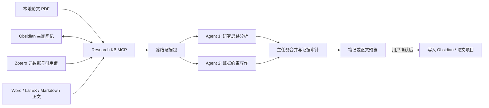

# Research Knowledge Workflow

> Obsidian + Zotero + Codex 协同的可追溯研究知识库工作流

`Research Knowledge Workflow` 是一个面向通用科研场景的 Codex Plugin + Skill。它把本地论文正文、Obsidian 关联笔记、Zotero 文献元数据和论文项目组织为一套可检索、可追溯、可持续更新的研究工作流，用于知识库构建、研究思路提炼、论文撰写与证据审计。

它不限定学科。计算机、自然科学、工程、社会科学、经管和交叉研究都可以使用同一套证据框架；`ai4management` 仅在经管类任务中作为可选领域增强，而不是通用工作流的前置条件。

## 核心能力

- **构建知识库**：按本地论文目录聚合全文，生成带来源定位和双向链接的 Obsidian 主题笔记。
- **提炼研究思路**：从已有文献中识别问题、争议、机制、方法缺口和可检验的研究问题。
- **辅助论文撰写**：基于证据包起草或修改 Markdown、Word、LaTeX 论文内容。
- **审计论证与引用**：检查主张是否有正文或摘要支撑，区分事实、推断、假设和待补证据。
- **按需补充检索**：Zotero 条目没有本地正文时，仅在当前任务确有需要时调用学术检索能力核验摘要，不批量补全整个文献库。

所有实质性任务固定使用两个 Codex Agent。两个 Agent 接收同一份冻结证据包，分别负责研究分析和证据约束写作，由父任务完成检索、合并、预览与写入。



## 四种工作模式

| 模式 | 作用 |
|---|---|
| `build-knowledge` | 按相对目录分析本地 PDF，预览或更新 Obsidian 主题知识笔记 |
| `ideate` | 从本地知识库与按需核验的外部文献中提炼研究问题和可验证方案 |
| `write` | 根据证据台账起草或修改论文段落，不静默改写源文件 |
| `audit` | 检查研究思路或论文的逻辑、方法、创新边界、主张支撑和引用完整性 |

本地 PDF 与 Zotero 保持相互独立，不要求建立完整的一一对应关系。Zotero 中没有附件不影响本地正文入库，本地 PDF 没有 Zotero 条目也仍然可以被分析。

## 项目结构

```text
research-knowledge-workflow/
|- .codex-plugin/plugin.json
|- .mcp.json
|- skills/
|  `- research-knowledge-workflow/
|     |- SKILL.md
|     |- agents/openai.yaml
|     `- references/
|- mcp-server/
|- scripts/
|- config.example.toml
`- README.md
```

仓库、Plugin、Skill 与 MCP 统一使用 `research-knowledge-workflow`。旧版 `%APPDATA%\management-research-kb\config.toml` 和 `MANAGEMENT_RESEARCH_KB_CONFIG` 环境变量仍可回退读取，已有本地配置不必立即迁移。

## 使用条件

- 支持 Plugin、Skill、MCP 和子 Agent 的 Codex。
- 一个包含本地论文正文或论文链接的 Obsidian Vault。
- Zotero；需要稳定引用键时建议安装 Better BibTeX。
- 可选的 `gs-search`、`gs-fulltext` 或 `academic-search`，用于当前任务所需的摘要或正文核验。
- 可选的领域 Skill，例如经管研究中的 `ai4management`。

Obsidian 的 Zotero Integration 可以继续用于个人阅读和导入，但本工作流不要求每篇 Obsidian 论文都能匹配 Zotero 条目。

## 本地安装

在仓库根目录执行：

```powershell
powershell -NoProfile -ExecutionPolicy Bypass -File .\scripts\install.ps1 `
  -VaultPath "C:\path\to\your\ObsidianVault" `
  -ManuscriptsRoot "C:\path\to\your\paper-projects"
```

安装脚本会创建隔离的 Python 环境，将新配置写入 `%APPDATA%\research-knowledge-workflow\config.toml`，并把 SQLite 派生缓存保存在 `%LOCALAPPDATA%\research-knowledge-workflow`。将仓库添加为本地 Codex Plugin 后，重新加载 Codex 并新建任务，使 Skill 与 MCP 重新发现。

首次运行建议只同步一个相对目录，例如 `机器学习/多视图/渐进融合`，确认预览符合预期后再扩大范围。

## 配置说明

复制并修改 [config.example.toml](config.example.toml)，真实配置不要提交到 Git。

- `vault_path`：Obsidian Vault，也是默认的本地 PDF 检索根目录。
- `notes_dir`：Vault 内生成主题知识笔记的相对目录。
- `manuscripts_root`：可选的 Word、LaTeX 或 Markdown 论文项目根目录。
- `cache_dir`：本地索引目录，应放在 OneDrive、Obsidian 等同步目录之外。
- `zotero_base_url`：Zotero 本地只读 API 地址。

`.mcp.json` 将 MCP 注册为 `research-knowledge-workflow`。安装或更新插件后需要重新加载 Codex。

## 快速使用流程

下面是一条从“本地已有论文”到“形成研究思路并开始写作”的推荐路径。第一次使用时按顺序执行，后续只需从对应阶段进入。

### 第一步：整理输入

1. 把已下载的论文按研究主题放入 Obsidian Vault，例如 `机器学习/多视图/渐进融合/`。
2. 文件名建议使用 `年份_标题.pdf`，方便人工浏览；工作流不会强制重命名已有文件。
3. 在 Zotero 中继续维护题录、Collections、Tags 和 Better BibTeX 引用键。Zotero 与本地 PDF 不必完整一一对应。

### 第二步：安装并检查连接

运行安装脚本、重新加载 Codex 后，先输入：

```text
使用 $research-knowledge-workflow 检查知识库状态，只读取配置并报告 Obsidian、索引和 Zotero 的连接情况，不执行全库同步。
```

确认 Vault、缓存目录和 Zotero 状态正常后，再进入知识构建。Zotero 暂时不可用时仍可处理本地 PDF，只会把题录覆盖标记为不完整。

### 第三步：构建主题知识笔记

```text
使用 $research-knowledge-workflow 的 build-knowledge 模式，同步“机器学习/多视图/渐进融合”目录，生成 Obsidian 主题笔记预览。保留页码、引用键和相关笔记链接，不要直接写入。
```

检查预览中的来源清单、综合结论、冲突和 `[[双向链接]]`。内容正确后回复“确认写入该笔记”，父任务才会重新校验目标并应用修改。

### 第四步：提炼研究思路

```text
使用 $research-knowledge-workflow 的 ideate 模式，基于刚生成的主题笔记和原始论文，提出一个可检验的研究问题。输出问题背景、核心机制、最近邻工作、方法设计、验证或证伪路径，以及待补证据清单。
```

这一阶段固定由两个 Agent 基于同一证据包完成思路构建和证据约束审查。需要判断创新性时，工作流会记录外部检索范围；未完成检索则返回 `not_assessed`。

### 第五步：辅助论文撰写

```text
使用 $research-knowledge-workflow 的 write 模式，根据已确认的研究思路和 claim ledger 起草相关工作小节。关键主张附引用键和页码，证据不足处标记 [EVIDENCE_NEEDED]，先返回草稿，不修改源文件。
```

审阅草稿后，可继续使用 `audit` 模式检查论证、方法、引用和创新边界。只有明确指定目标文件并确认差异预览后，才应用到 Word、LaTeX 或 Markdown 正文。

```text
本地论文与 Zotero -> build-knowledge -> Obsidian 主题笔记 -> ideate -> 研究方案 -> write -> 论文草稿 -> audit -> 修订
```

## 完整使用实例

下面以“机器学习 / 多视图学习 / 渐进融合”目录为例。假设 Vault 中已有：

```text
文献/
`- 机器学习/
   `- 多视图/
      `- 渐进融合/
         |- 2025_Dynamic_Progressive_Fusion.pdf
         `- 2025_Enhanced_Then_Progressive_Fusion.pdf
```

### 1. 生成 Obsidian 主题笔记

向 Codex 输入：

```text
使用 $research-knowledge-workflow 的 build-knowledge 模式，分析“机器学习/多视图/渐进融合”目录下的论文，先预览主题笔记，不要直接写入。
```

工作流会：

1. 增量读取两篇 PDF，并保留页码定位。
2. 尝试用 DOI 或“标题 + 年份”匹配 Zotero 元数据和 Better BibTeX 引用键。
3. 由 **Local Literature Reader** 提炼研究问题、方法、数据、结论、局限和文献类型。
4. 由 **Cross-Link Auditor** 查找相关 Obsidian 笔记，提出有解释依据的 `[[双向链接]]`、冲突和去重建议。
5. 预览 `机器学习_多视图_渐进融合.md`；只有在用户确认后才写入 `notes_dir`。

再次同步时，未变化的 PDF 会被跳过；笔记中位于 `My Notes` 区域的人工内容不会被生成区覆盖。

### 2. 从知识库提炼研究思路

```text
使用 $research-knowledge-workflow 的 ideate 模式，基于“机器学习_多视图_渐进融合”及其关联文献，提出一个针对不完整多视图数据的可检验研究思路。请给出研究问题、核心机制、与最接近工作的差异、实验设计、证伪路径和仍需检索的证据。
```

此时两个 Agent 会基于同一证据包独立工作：**Idea Builder** 负责构建问题、机制和研究设计，**Evidence-Constrained Writer** 负责检查每项贡献能否被现有证据支撑。没有完成外部近邻文献检索时，创新性会标记为 `not_assessed`，不会把“本地没有搜到”误写成研究空白。

### 3. 辅助撰写论文段落

```text
使用 $research-knowledge-workflow 的 write 模式，根据已确认的研究思路和证据台账，起草“相关工作：渐进式多视图融合”小节。每个关键主张都标注引用键和正文页码；证据不足处保留 [EVIDENCE_NEEDED]，不要直接修改我的 LaTeX 文件。
```

Codex 会返回可审阅的段落、主张台账和引用定位。确认内容后，再明确要求应用到目标 `.tex`、`.docx` 或 `.md` 文件。

### 4. 可选的经管领域增强

当研究问题属于经管学科时，可以显式启用 `ai4management`：

```text
使用 $research-knowledge-workflow 和 $ai4management，研究多模态信息如何影响直播带货效果预测。基于本地知识库提炼管理情境、决策主体、机制、方法设计和可证伪假设，并保持所有事实主张可追溯。
```

`ai4management` 只提供领域推理和审计框架，不作为文献证据，也不会额外创建第三个 Agent。

## Zotero 与缺失正文

Zotero 提供题录身份、Collections、Tags、Notes、附件状态和引用键。附件“存在”不等于正文“已读取”。本地 PDF 可以保持未匹配，Zotero 条目也可以保持仅元数据状态。

当某条仅有元数据的 Zotero 文献对当前任务确实关键时，父任务才会调用可用的学术检索 Skill 核验摘要或寻找全文。摘要证据只能支撑摘要明确陈述的研究目标、方法和结论，不能支撑正文细节。

## 证据边界

- 细节性事实主张需要带页码定位的全文证据。
- 已核验摘要只支持摘要明确陈述的高层信息。
- 仅元数据记录只用于发现、去重和引用身份。
- Obsidian 综合笔记是检索线索，引用时仍需回到原始文献。
- 本地检索无结果不能证明创新性；创新判断需要记录外部检索范围、查询式和截止日期。
- 每项重要主张进入 claim ledger，每次检索决策进入 retrieval trace。

## 写入安全

默认输出是尚未应用的草稿或差异预览。用户确认后才允许写入：

- 更新 Obsidian 笔记时保留托管区之外的人工内容，并校验预览时摘要，防止覆盖并发修改。
- 修改 Word 时保留 Zotero 域、样式、批注和修订标记。
- 修改 LaTeX 时保留宏、标签、参考文献命令和引用键。
- 目标文件在预览后发生变化时终止应用并重新生成预览。

## 验证

```powershell
python C:\path\to\skill-creator\scripts\quick_validate.py .\skills\research-knowledge-workflow
```

发布前还应验证：

- 所有 Markdown 链接有效，`SKILL.md` 少于 500 行。
- MCP 能被发现，且每次实质性任务只创建并关闭两个 Agent。
- 笔记和论文写入必须停在预览阶段等待确认。
- Git 暂存区不包含本地路径、PDF、笔记、缓存、论文、Zotero 数据或凭据。

## 隐私

仓库仅应包含源代码、模式定义、模板和合成测试数据。不要提交 Obsidian Vault、生成笔记、PDF、Zotero 数据库或附件、私人文献库导出、论文文件、证据包、本地索引、真实配置、凭据和个人绝对路径。
